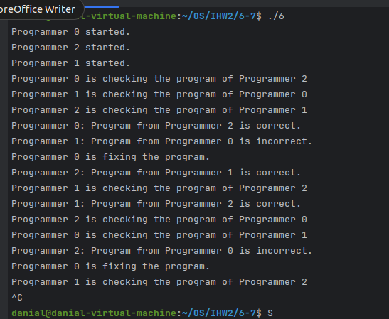

# ИДЗ - 2
## Бакиров Даниал Жандарбекович БПИ 226
### вариант 24

### задача:
Задача о программистах. В отделе работают три программиста. Каждый программист пишет свою программу и отдает ее на проверку одному из двух оставшихся программистов, выбирая его случайно и ожидая окончания проверки. Программист начинает проверять чужую программу, когда его собственная уже написана и передана на проверку. По завершении проверки, программист возвращает программу с результатом (формируемым случайно по любому из выбранных Вами законов): программа написана правильно или неправильно. Программист «спит», если отправил свою программу и не проверяет чужую программу. Программист «просыпается», когда получает заключение от другого программиста. Если программа признана правильной, программист пишет другую программу, если программа признана неправильной, программист исправляет ее и отправляет на проверку тому же программисту, который ее проверял. К исправлению своей программы он приступает, завершив проверку чужой программы. При наличии в очереди проверяемых программ и приходе заключения о неправильной своей программы программист может выбирать любую из возможных работ. Необходимо учесть, что кто-то из программистов может получать несколько программ на проверку. Создать многопроцессное приложение, моделирующее работу программистов. Каждый программист — это отдельный поток.

## 4 - 5 баллов
Сценарий решаемой задачи:

Родительский процесс создает неименованные семафоры и разделяемую память. \
Родительский процесс запускает требуемое число дочерних процессов. \
Каждый дочерний процесс получает доступ к разделяемой памяти и семафорам. \
Дочерние процессы с помощью семафоров координируют свои действия, например, для синхронизации доступа к разделяемым данным. \
По завершении работы родительский процесс удаляет семафоры и разделяемую память. \

### Результаты работы программы

## 6 - 7 баллов
Код использует семафоры и разделяемую память из стандарта POSIX для взаимодействия между процессами. Все изменения и обмен данными происходят через эту разделяемую память с помощью семафоров для синхронизации доступа.
\
После нажатия Ctrl + C, все созданные семофоры закрываются и удаляются
, а так же разделяемая память тоже удаляется

## 8 Баллов

код создает несколько независимых процессов, каждый из которых увеличивает счетчик в разделяемой памяти с использованием семафора для синхронизации доступа. Приложение завершает работу при получении сигнала SIGINT (Ctrl+C), и разделяемая память и семафор удаляются.

