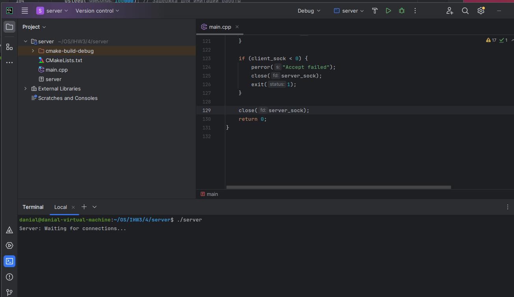
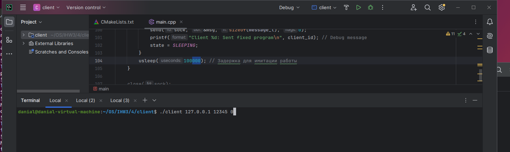
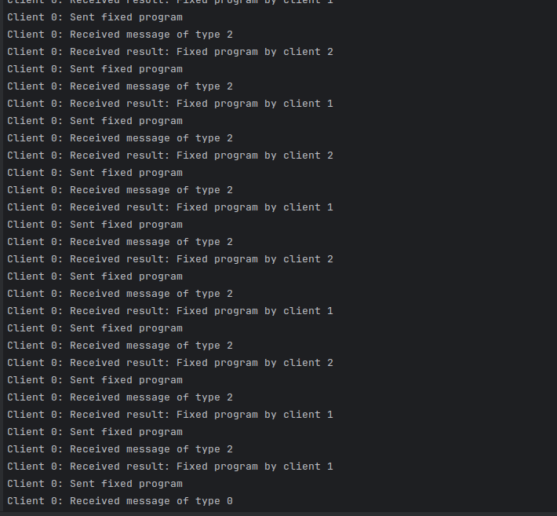
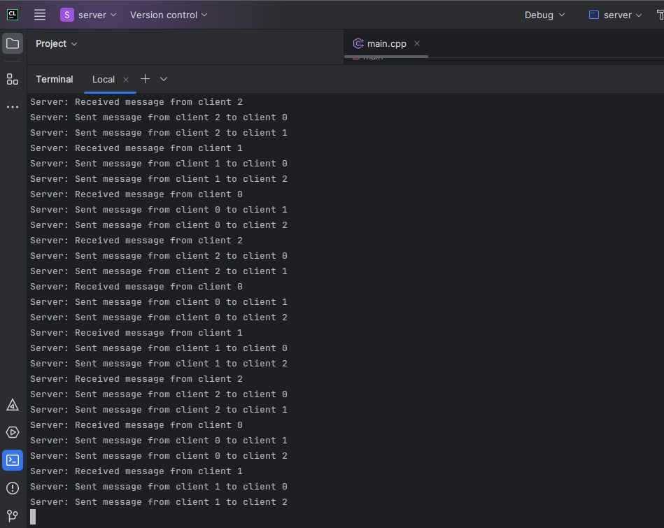
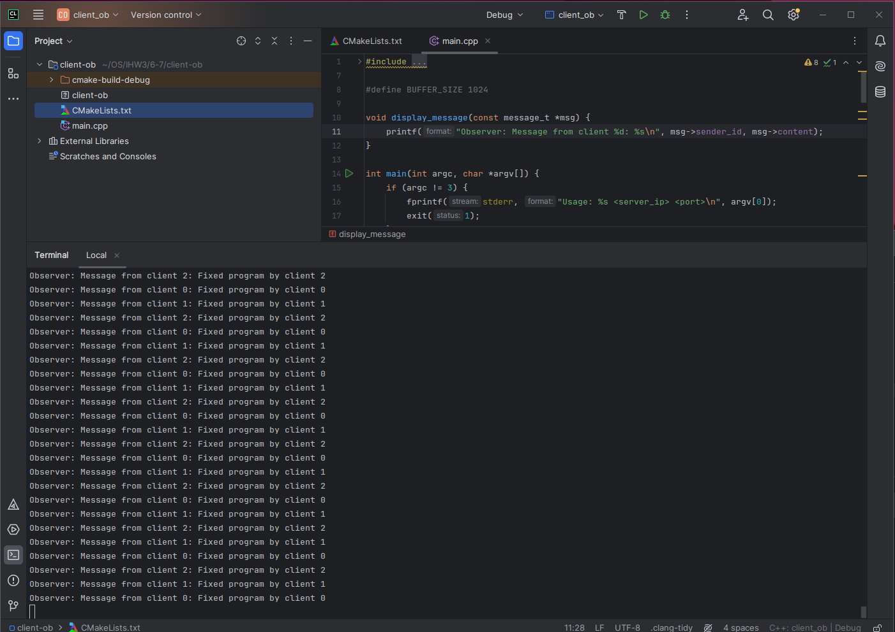
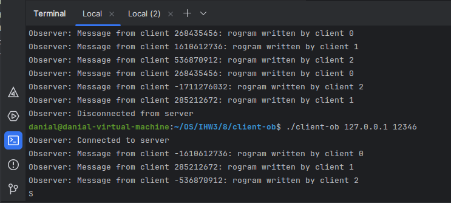
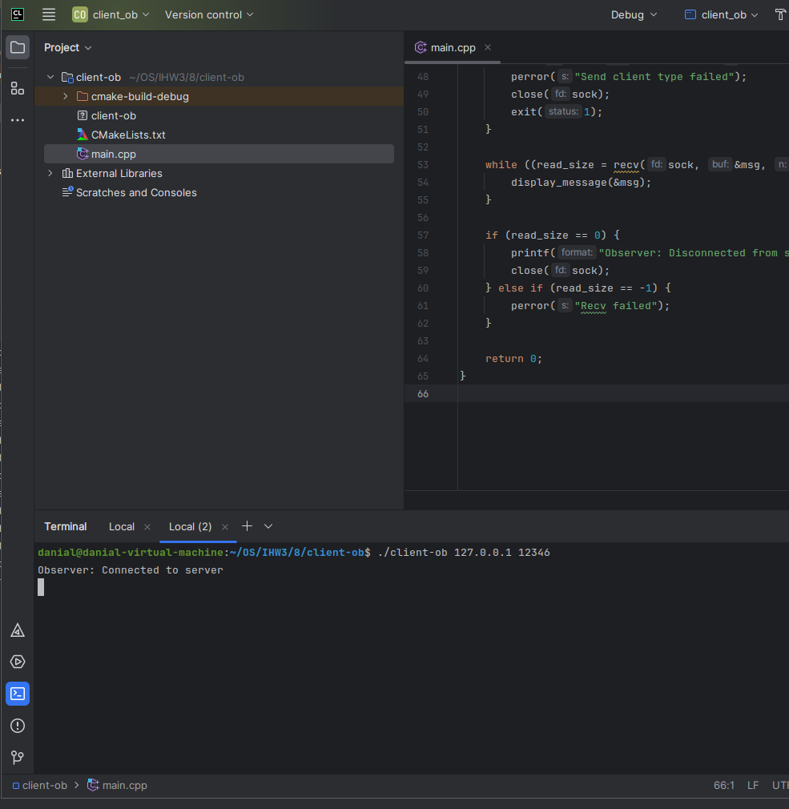
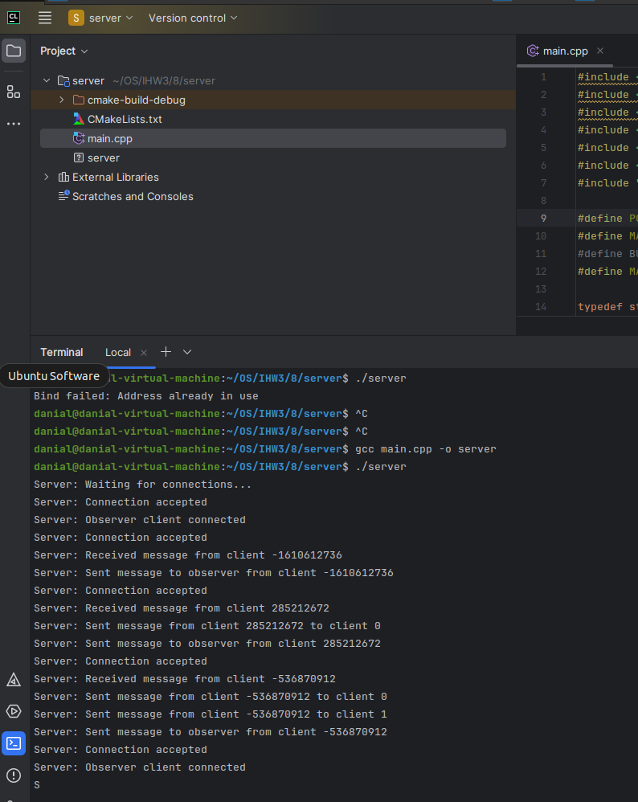

# ИДЗ 3
## Бакиров Даниал Жандарбекович БПИ 226 
### Вариант 24
#### Условие задачи : Задача о программистах. В отделе работают три программиста. Каждый программист пишет свою программу и отдает ее на проверку одному из двух оставшихся программистов, выбирая его случайно и ожидая окончания проверки. Программист начинает проверять чужую программу, когда его собственная уже написана и передана на проверку. По завершении проверки, программист возвращает программу с результатом (формируемым случайно по 22любому из выбранных Вами законов): программа написана правильно или неправильно. Программист «спит», если отправил свою программу и не проверяет чужую программу. Программист «просыпается», когда получает заключение от другого программиста. Если программа признана правильной, программист пишет другую программу, если программа признана неправильной, программист исправляет ее и отправляет на проверку тому же программисту, который ее проверял. К исправлению своей программы он приступает, завершив проверку чужой программы. При наличии в очереди проверяемых программ и приходе заключения о неправильной своей программы программист может выбирать любую из возможных работ. Необходимо учесть, что кто-то из программистов может получать несколько программ на проверку. Создать клиент–серверное приложение, моделирующее работу программистов. Каждый программист — отдельный клиент. Сервер обеспечивает передачу данных между клиентами.

#### 4 - 5 баллов
При запуске клиентов идет ввод ip адресса, хоста и пишется номер клиента
Сервер

Задание клиента

Логи клиента

Логи сервера 

#### 6 -7 баллов
Была добавленна возможность - клиент-наблюдатель, в нем отображается все информация о клиентах

#### 8 баллов

Была добавленна возможность - появилась возможность отключать и подключать неслоколько клиентов-наблюдателей без нарушения работты программы\

